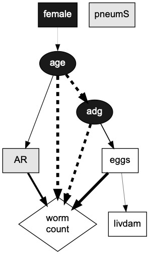

&nbsp;

For this hands-on exercise, we will use an adaptation of the **pig_adg** dataset described in *Dohoo, Martin and Wayne - Veterinary Epidemiologic Research (second edition)* (see [@dohoo2003veterinary]).

<!-- availble at: http://projects.upei.ca/ver/data-and-samples/ -->

&nbsp;

```{r setup, include=FALSE}
knitr::opts_chunk$set(echo = FALSE, warning=FALSE, message=FALSE, collapse=FALSE,
                      fig.align='center', fig.height=3, fig.width=5, comment = NA)


options(scipen=999)
library(abn)
library(knitr)
library(kableExtra)
library(dplyr)
```

Let's install all required and suggest package from **abn** (if not already done)

```{r installpackages, echo=TRUE, eval=FALSE}
## dplyr is used for the hands-on exercise

install.packages(c("nnet", "lme4", "Rgraphviz", "knitr", "R.rsp", "testthat", "entropy", "moments", "boot", "brglm", "dplyr"))

```

Let's load the data into the working environment:  

`require('abn'); data("adg", package = "abn")`

let us work with a data.frame as required by abn.
`adg <- adg %>% as.data.frame()`


&nbsp;

The data for this exercise consist of **`r nrow(adg)`** observations of **`r ncol(adg)`** variables. Here is an extract of the first rows:  


```{r dataoverview, echo=TRUE, cache=FALSE}
knitr::kable(head(adg)) %>%
  kable_styling(bootstrap_options = c("striped", "hover"))

```
&nbsp;

The meaning of each variable is the following: 

```{r dataMeaning, echo=FALSE, cache=FALSE}
mm <- data.frame(Variable = colnames(adg),
                 Meaning = c("presence of atrophic rhinitis",
                             "presence of moderate to severe pneumonia",
                             "sex of the pig (1=female, 0=castrated)",
                             "presence of liver damage (parasite-induced white spots)", 
                             "presence of fecal/gastrointestinal nematode eggs at time of slaughter",
                             "count of nematodes in small intestine at time of slaughter",
                             "days elapsed from birth to slaughter (days)",
                             "average daily weight gain (grams)",
                             "farm ID"), Distribution = c("Binomial", "Binomial","Binomial","Binomial","Binomial", "Poisson", "Continuous", "Continuous", "Discrete"))

knitr::kable(mm, row.names = FALSE, digits = 2, align = "ll", "html") %>%
  kable_styling(bootstrap_options = c("striped", "hover"),full_width = FALSE, position = "left")

```

The distribution of each variable is the following: 

```{r dataDist, echo=FALSE, cache=FALSE, fig.width=10, fig.height=10}

par(mfrow=c(3,3), mar=c(2,4,1.5,1))
xx <- barplot(table(adg$AR)/341, ylim=c(0,1), main="AR", ylab="proportion")
text(x = xx, y = table(adg$AR)/341, label = table(adg$AR), pos = 3, cex = 0.8, col = "red")
xx <- barplot(table(adg$pneumS)/341, ylim=c(0,1), main="pneumS", ylab="proportion")
text(x = xx, y = table(adg$pneumS)/341, label = table(adg$pneumS), pos = 3, cex = 0.8, col = "red")
xx <- barplot(table(adg$female)/341, ylim=c(0,1), main="female", ylab="proportion")
text(x = xx, y = table(adg$female)/341, label = table(adg$female), pos = 3, cex = 0.8, col = "red")
xx <- barplot(table(adg$livdam)/341, ylim=c(0,1), main="livdam", ylab="proportion")
text(x = xx, y = table(adg$livdam)/341, label = table(adg$livdam), pos = 3, cex = 0.8, col = "red")
xx <- barplot(table(adg$eggs)/341, ylim=c(0,1), main="eggs", ylab="proportion")
text(x = xx, y = table(adg$eggs)/341, label = table(adg$eggs), pos = 3, cex = 0.8, col = "red")
hist(adg$wormCount, main="worms",prob=TRUE,col="grey",border="white", ylim= c(0,0.6))
lines(density(adg$wormCount),lwd=1.5)
hist(adg$age, xlab="", main="age",prob=TRUE,col="grey",border="white")
  lines(density(adg$age),lwd=1.5)
hist(adg$adg, xlab="", main="adg",prob=TRUE,col="grey",border="white")
  lines(density(adg$adg),lwd=1.5)
barplot(table(adg$farm), main="Farm ID", ylim=c(0,40), ylab="count", col.main = "gray50")


```

&nbsp;

For this exercise we will drop *farm* (clustering indicator):  


```{r datafilter, echo=TRUE}

drop <- which(colnames(adg)%in% c("farm"))
abndata <- adg[, -drop]

```

&nbsp;

# Set all binary variables to factor data type (and check that dataset is complete) 

A requirement of *abn* [@lewis2013improving; @kratzer2017abn] is that all binary variables are coerced into factors.  

```{r dataFactor, echo=TRUE}

str(abndata)
abndata[,1:5] <- as.data.frame(lapply(abndata[,1:5], factor))
sum(complete.cases(abndata))

```

&nbsp;

# Setup the distribution list for each variable  

Each variable in the model needs to be associated to a distribution (currently available: binomial, gaussian, poisson) according to the type of data. In this example most of the variables are binary and therefore associated to the **binomial** distribution. Variables *age* and *adg* are continuous, so they will be associated to the **Gaussian** distribution. Finally, variable **wormCount** is a count and can be modelled by a **Poisson** distribution. 

The supported distributions are:

* gaussian with identity link function
* binomial with logit link function (required data to be factor)
* Poisson distributed with log link function
* multinomial with logit link function (required data to be factor. Only available with mle fitting)


```{r dists, echo=TRUE}

dist <- list(AR = "binomial", pneumS = "binomial", female="binomial", 
             livdam= "binomial", eggs = "binomial",wormCount = "poisson",
             age= "gaussian", adg = "gaussian")

```

&nbsp;

# Create retain and banned matrixes (optional)  

Prior knowledge about data structure, that could guide the search for the optimal model, can be included by forcing or banning some specific arcs from being considered in the final DAG. This is done by providing a **retain matrix** and/or a **ban matrix**. 
We will start by creating two empty matrices with the same size as our data (8) and named rows and columns.

```{r ban_ret, echo=TRUE}

retain <- matrix(0, ncol(abndata), ncol(abndata))
colnames(retain) <- rownames(retain) <- names(abndata)

banned <- matrix(0, ncol(abndata), ncol(abndata))
colnames(banned) <- rownames(banned) <- names(abndata)

```

&nbsp;

# Ban some arcs (optional)
The information encoded in the ban matrix is *subjectively chosen* to reflect our **belief about data structure**. In this example, it is reasonable to assume that none of the variables in the model is going to affect the gender of the animal (which is an inborn trait). To encode this information we will ban all the arcs going to *female*, by setting their value to 1 (banned) as opposite to the default value 0 (non banned).  

How does it work?

Rows are children, columns parents:   
`.   b1 b2 b3 b4`  
`b1   0  1  0  0`  
`b2   0  0  0  0`  
`b3   1  0  0  0`  
`b4   0  0  0  0`  

So `ban[1, 2] <- 1`  means do not allow the arc from b2 (second column) to b1 (first row) and `ban[3, 1] <- 1` means do not allow the arc from b1 (first column) to b3 (third row).

Now, we want to ban the arcs going from any variable (= all columns except the third) to *female* (= third row):  
```{r ban, echo=TRUE}

banned[3,-3] <- 1

```

Have a look if you want:  
```{r banCheck, echo=TRUE}

banned

```

&nbsp;

# Try to run one search  
&nbsp;

## Start with 1 parent as maximum limit

abn supports an mle and Bayesian implementation. We will run a Bayesian (default) analysis. 

To make the search more efficient, we constrain the maximum number of parents allowed for each node. We will start from 1 and increase subsequently until the *network score* does not improve further even when more parents are allowed. 

```{r 5.1, echo=TRUE}

max.par <- 1 

```
&nbsp;

## Build a cache of all local computations

```{r 5.2, echo=TRUE}
library(abn)

mycache <- buildScoreCache(data.df = as.data.frame(abndata), data.dists = dist, 
                           dag.banned = banned, dag.retained = retain, 
                           max.parents = max.par)

```

The function *buildScoreCache()* returns a named list of class *abnCache* that contains all necessary data and infrmation to be used in *mostProbable()*. For each node, the *buildScoreCache()* function tries every combination of parent nodes (always satisfying the constraints *max.par*, *banned*, *retained*) and computes a score. The parent children combinations are then stored, together with their scores. This object contains all the information needed for different functions, that try to learn the structure of the network. 

&nbsp; 


## Run the exact search for a specified parent limit  

a) Find the optimal DAG given the parent limit

```{r 5.3a, echo=TRUE}
mydag <- mostProbable(score.cache = mycache)
```
  
b) Fit marginal densities
```{r 5.3b, echo=TRUE}
fabn <- fitAbn(object = mydag)
```
  
c) check network score
```{r 5.3c, echo=TRUE}
fabn$mlik
```

The function *mostProbable()* returns an object of class *abnMostprobable*, which is a list containing: a matrix giving the DAG definition of the most probable posterior structure, the cache of pre-computed scores and the score used for selection.

The function *fitAbn()* returns an object of class *abnFit*. A named list. One entry for each of the variables in data.df (excluding the grouping variable, if present) which contains an estimate of the log marginal likelihood for that individual node. An entry "mlik" which is the total log marginal likelihood for the full ABN model. A vector of error.codes - non-zero if a numerical error or warning occurred, and a vector error.code.desc giving a text description of the error. A list modes, which contains all the mode estimates for each parameter at each node. A vector called Hessian accuracy, which is the estimated local error in the log marginal likelihood for each node. If compute.fixed=TRUE then a list entry called marginals which contains a named entry for every parameter in the ABN and each entry in this list is a two-column matrix where the first column is the value of the marginal parameter, say x, and the second column is the respective density value, pdf(x). Also, a list called marginal.quantiles is produced, giving the quantiles for each marginal posterior distribution. If create.graph=TRUE then an additional entry graph which is of type class *graphAM-class* (Rgraphviz) is created.

&nbsp;

# Run the exact search across incremental parent limits 
Repeat step 5 for incremental parent limit (e.g. 1 to nr.var-1). The optimal DAG is the one where the network score does not improve (i.e. becomes bigger) any longer by allowing more parents.  

```{r search, echo=TRUE}

datadir <- tempdir() 

for (i in 1:7) {
  max.par <- i
  
  mycache <- buildScoreCache(data.df = as.data.frame(abndata), data.dists = dist, 
                             dag.banned = banned, dag.retained = retain, 
                             max.parents = max.par)
  
  mydag <- mostProbable(score.cache = mycache)
  
  fabn <- fitAbn(object = mydag)
  
  cat(paste("network score for", i, "parents =", fabn$mlik, "\n\n"))
      
  save(mycache, mydag, fabn, file = paste(datadir,"mp_", max.par,".RData", sep=""))
 
}

# get network score for all parent limits
# ---------------------------------------
mp.mlik <- c()
for (i in 1:max.par) {
  load(paste(datadir,"mp_", i,".RData", sep=""))
  mp.mlik <- c(mp.mlik, fabn$mlik)
}

```

&nbsp;

# Plot log marginal likelihood in function of the parent limit

```{r mlik, echo=TRUE}

# check how it looks
# ------------------
plot(1:max.par, mp.mlik, xlab = "Parent limit", ylab = "Log marginal likelihood", 
     type = "b", col="red", ylim=range(mp.mlik))
abline(v=which(mp.mlik==max(mp.mlik))[1], col="grey", lty=2)

```

After max.par=`r which(mp.mlik==max(mp.mlik))[1]` the maximum log marginal likelihood is constant:  

```{r mlik2, echo=FALSE}

mp.mlik
 
```

&nbsp;

Here is what the best fitting DAG looks like using *plotAbn()* function:

```{r DAGshow}

plotAbn(mydag)

```

&nbsp;

Before going ahead interpreting the results, we need one more step. So far, we have identified a DAG which has the maximum possible goodness of fit according to the log marginal likelihood. This is the standard goodness of fit metric in Bayesian modeling and includes an implicit penalty for model complexity. However, the log marginal likelihood is also known to be prone to **overfitting** (especially with smaller data sets), meaning that it may identify more parameters than can be actually justified by the data. Therefore, it is advisable to check and address potential overfitting before drawing any conclusion based on the model results. 

A well established approach for addressing overfitting is to use **parametric bootstrapping**. Basically, the model chosen from the exact search will be used to generate many bootstrap datasets (e.g. 1000) of equal size to the original dataset (n=`r nrow(abndata)` in our case). Each bootstrap dataset will be then treated as if it were the original data, and a globally optimal DAG will be identified exactly as described before (i.e. exact search). We will therefore get as many DAGs as the number of simulated datasets (eg. 1000). To address overfitting, any arcs in the DAG from the original data which will not be recovered in > 50% of the bootstrap DAGs will be deemed to have insufficient statistical support to be considered robust. 

&nbsp;

# Parametric bootstrapping 

This step will be done with the aid of a software for Bayesian statistical analysis using Markov Chain Monte Carlo (MCMC) simulations (we will use **JAGS** [@plummer2003jags], but any other is fine). We will use the parameters estimated from our model to build a *BUG* model to simulate data. In other words, we will do the reverse process: instead of using data to estimate parameters, we will use parameters to estimate data. 

&nbsp;

## Extract parameters from best fitting model and save them for MCMC simulations  

The parameters at each node are estimated as posterior probability density distributions. These marginal densities are the ones where JAGS needs to sample from in order to simulate data. In order to use these distributions with JAGS, the densities need to be approximated by a discrete distribution over a fine and equally spaced grid. Here is a mock example for a hypothetical parameter $\beta$:

```{r exGrid, , fig.height=3, fig.width=8}

v1 <- rnorm(10000, 0, 1)
par(mfrow=c(1,2), mar=c(4,4,2,1)) 

plot(density(v1), main="Marginal density", xlab=expression(paste("parameter ", beta)), 
     cex.axis=0.9, cex.main=1)
hist(v1, breaks=100, main="Discretization of marginal density", xlab=expression(paste("parameter ", beta)), 
     cex.axis=0.9, cex.main=1)

```

&nbsp;

```{r prepBoot, echo=TRUE}
# Fit marginal densities over a fixed grid --> n.grid=1000
# --------------------------------------------------------
  marg.f <- fitAbn(object = mydag, compute.fixed=TRUE, n.grid=1000)

# Extract values 
# --------------
  m <- marg.f$marginals[[1]] 
  for(i in 2: length(marg.f$marginals))
  { m <- c(m, marg.f$marginals[[i]])}
  
# Bind all the marginals for the same node into a matrix
# ------------------------------------------------------
  AR.p <- cbind( m[[ "AR|(Intercept)"]], m[[ "AR|age"]])
  pneumS.p <- cbind( m[[ "pneumS|(Intercept)"]], m[[ "pneumS|age"]])
  female.p <- cbind( m[[ "female|(Intercept)"]])
  livdam.p <- cbind( m[[ "livdam|(Intercept)"]], m[[ "livdam|eggs"]])
  eggs.p <- cbind( m[[ "eggs|(Intercept)"]], m[[ "eggs|adg"]])
  wormCount.p <- cbind( m[[ "wormCount|(Intercept)"]], m[[ "wormCount|AR"]],
                        m[[ "wormCount|eggs"]], m[[ "wormCount|age"]], m[[ "wormCount|adg"]])
  age.p <- cbind( m[[ "age|(Intercept)"]], m[[ "age|female"]])
  prec.age.p <- cbind( m[[ "age|precision" ]])
  adg.p <- cbind( m[[ "adg|(Intercept)"]], m[[ "adg|age"]])
  prec.adg.p <- cbind( m[[ "adg|precision" ]])

# Save it to a file named PostParams to be read by JAGS
# -----------------------------------------------------
  dump(c("AR.p", "pneumS.p", "female.p", "livdam.p", "eggs.p", 
       "wormCount.p", "age.p", "prec.age.p", "adg.p", "prec.adg.p"),
     file="PostParams.R")

```

&nbsp;

## Write the BUG model
In order to simulate the variables of our dataset we need to provide a model for each of them, using the aforementioned parameters estimates. For instance, the binomial node *AR* in our DAG has one incoming arc coming from the node *age*. In a regression notation this would be translated into:  

<p style="text-align: center;">logit(*AR*) = $\alpha$ + $\beta$ x *age* + $\epsilon$</a></p>
        
      
where $\alpha$ is the intercept and $\beta$ the regression coefficient for variable *age* and $\epsilon$ is the error term modelled by a binomial distribution.  

Given that we will simulate the data in a Bayesian framework, AR will be modelled as a probability distribution. Therefore it will look like:  

`AR ~ dbern(probAR);`  
`logit(probAR)<- alpha + beta*age;`  

Then, the values of alpha and beta will be sampled (dcat) from our discrete distribution of parameters:  

`alpha.prob ~ dcat(AR.p[ ,2]);` --> sample from the vector of density values f(x) (second column in matrix)  
`alpha ~ AR.p[alpha.prob,1];`   --> corresponding x value for the sampled density (first column in matrix)  
`beta.prob ~ dcat(AR.p[ ,4]);`  
`beta ~ AR.p[beta.prob,1];`   
 
&nbsp; 

The BUG file (*model8vPois.bug*) can be retrieved from the *file* directory.

&nbsp;

## Run JAGS and inspect the result of a simulated dataset

```{r testJAGS, echo=TRUE}

library(rjags)

# set inits
# ---------
init <- list(".RNG.name"="base::Mersenne-Twister", ".RNG.seed"=42)

# load data
# ---------
source("PostParams.R")

# run model once
# --------------
jj <- jags.model(file = "model8vPois.bug", 
                 data = list(  'AR.p'=AR.p , 'pneumS.p'=pneumS.p , 'female.p'=female.p, 
                               'livdam.p'=livdam.p , 'eggs.p'=eggs.p , 'wormCount.p'=wormCount.p , 
                               'age.p'=age.p ,'prec.age.p'=prec.age.p, 
                               'adg.p'=adg.p , 'prec.adg.p'=prec.adg.p),
                 inits = init,
                 n.chains = 1, 
                 n.adapt = 500)

# run more iterations
# -------------------
update(jj, 100000)

# set number of observation we want to extract for a dataset 
# ----------------------------------------------------------
n.obs=341

# sample data (same size as original: 341) with a sampling lag (20) to reduce avoid autocorrelation
# -------------------------------------------------------------------------------------------------
samp <- coda.samples(jj, c("AR", "pneumS", "female", "livdam", "eggs", 
                           "wormCount", "age", "prec.age", "adg", "prec.adg"),
                     n.iter= n.obs*20 , thin =20)

```

Now compare the simulated data with the original data. Observe that Gaussian nodes are by default centred when doing abn search, meaning that the simulated data for those nodes will be centred as well. 

```{r testJAGS2, echo=FALSE, fig.height=2, fig.width=10}
# extract posterior densities and put in a dataframe
# --------------------------------------------------
post.dt <- data.frame(AR = unlist(samp[,"AR"]),
                      pneumS = unlist(samp[,"pneumS"]),
                      female = unlist(samp[,"female"]),
                      livdam = unlist(samp[,"livdam"]),
                      eggs = unlist(samp[,"eggs"]),
                      wormCount = unlist(samp[,"wormCount"]),
                      age = unlist(samp[,"age"]),
                      adg = unlist(samp[,"adg"]))


# compare with original data
# --------------------------
dt<-abndata

# get centered version of age and adg to compare to bootstrap data
dt$age.c <- (dt$age - mean(dt$age))/sd(dt$age) 
dt$adg.c <- (dt$adg - mean(dt$adg))/sd(dt$adg) 

# Compare distribution of original and simulated data
# ---------------------------------------------------
par(mfrow=c(1,4), mar=c(2,2,1.5,1))

barplot(table(dt$AR)/341, ylim=c(0,1), main="AR - original")
barplot(table(post.dt$AR)/341,  ylim=c(0,1), main="AR - simulated", 
        col.main = "blue", border="blue") 

barplot(table(dt$pneumS)/341, ylim=c(0,1), main="pneumS - original")
barplot(table(post.dt$pneumS)/341,  ylim=c(0,1), main="pneumS - simulated", 
        col.main = "blue", border="blue") 

barplot(table(dt$female)/341, ylim=c(0,1), main="female - original")
barplot(table(post.dt$female)/341,  ylim=c(0,1), main="female - simulated", 
        col.main = "blue", border="blue") 

barplot(table(dt$livdam)/341, ylim=c(0,1), main="livdam - original")
barplot(table(post.dt$livdam)/341,  ylim=c(0,1), main="livdam - simulated", 
        col.main = "blue", border="blue")

barplot(table(dt$eggs)/341, ylim=c(0,1), main="eggs - original")
barplot(table(post.dt$eggs)/341,  ylim=c(0,1), main="eggs - simulated", 
        col.main = "blue", border="blue") 

hist(dt$wormCount, xlab="", main="wormCount - original",
     prob=TRUE,col="grey",border="white", ylim=c(0,0.6))
     lines(density(dt$wormCount),lwd=1.5)
     
hist(post.dt$wormCount, xlab="", main="wormCount - simulated", col.main = "blue", 
     prob=TRUE,col="grey",border="white", xlim=c(0,80), ylim=c(0,0.6))
     lines(density(post.dt$wormCount),lwd=1.5, col="blue")

hist(dt$age.c, xlab="", main="age - original",
     prob=TRUE,col="grey",border="white")
     lines(density(dt$age.c),lwd=1.5)
hist(post.dt$age, xlab="", main="age - simulated", col.main = "blue",
     prob=TRUE,col="grey",border="white")
     lines(density(post.dt$age),lwd=1.5, col="blue")

hist(dt$adg.c, xlab="", main="adg - original",
     prob=TRUE,col="grey",border="white")
     lines(density(dt$adg.c),lwd=1.5)
hist(post.dt$adg, xlab="", main="adg - simulated", col.main = "blue",
     prob=TRUE,col="grey",border="white")
     lines(density(post.dt$adg),lwd=1.5, col="blue")

```

Simulated data looks fairly OK (perhaps wormCount is sub-optimal as the simulated data miss to represent the long right tail) so we can proceed with the bootstrapping.  
 
&nbsp;

## Iterate dataset simulation + exact search over and over

What we will do is to create a loop to 1) simulate data, 2) do exact search on such data, and 3) store the best fitting DAG  over and over for many times (e.g. 1000 iterations). Bootstrap data need to be saved in a folder to be further inspected.

```{r bootABN, echo=TRUE, eval=FALSE}

# load data 
data("adg", package = "abn")

df <- adg %>%
  dplyr::select(-farm) %>%
  as.data.frame()

vars <- colnames(df)

# load data for jags
source("PostParams.R")

# select nr. bootstrap samples to run
# -----------------------------------
set.seed(46846)

n <- sample(1:100000, 1000)


# specify max number of parents based on previous search
# ------------------------------------------------------
max.par <- 4


# Simulate data and run ABN on such dataset
# -----------------------------------------
boot.save <- list()

for (i in 1:length(n)) {

  print(paste("Running simulation", i))

  # pick initials
  init <- list(".RNG.name"="base::Mersenne-Twister", ".RNG.seed"=n[i])

  # run model
  jj <- jags.model(file = "model8vPois.bug",
                   data = list(  'AR.p'=AR.p , 'pneumS.p'=pneumS.p , 'female.p'=female.p,
                                 'livdam.p'=livdam.p , 'eggs.p'=eggs.p , 'wormCount.p'=wormCount.p ,
                                 'age.p'=age.p ,'prec.age.p'=prec.age.p,
                                 'adg.p'=adg.p , 'prec.adg.p'=prec.adg.p),
                   inits = init,
                   n.chains = 1,
                   n.adapt = 500)

  # run more iterations
  update(jj, 100000)

  # sample data (same size as original: 341) with a sampling lag (20) to reduce avoid autocorrelation
  samp <- coda.samples(jj, c("AR", "pneumS", "female", "livdam", "eggs",
                             "wormCount", "age", "prec.age", "adg", "prec.adg"),
                       n.iter= 6820 , thin =20)

  # build dataframe in the same shape as the original one
  dt.boot <- as.data.frame(as.matrix(samp)) # pay attention at order names

  dt.boot<- dt.boot[, vars]


  # now coerce to factors if need be and set levels - NOTES setting levels works as
  # "0" "1" is in the same order as "absent" "present" from original data
  #abndata <- as.data.frame(abndata)

  dt.boot[,1:5] <- as.data.frame(lapply(dt.boot[,1:5], factor)) 
  
  
# Build a cache of all local computations
# ---------------------------------------
 mycache <- buildScoreCache(data.df = dt.boot, data.dists = dist, dag.banned = banned,
                             dag.retained = retain, max.parents = max.par)

# Run the EXACT SEARCH
# --------------------
 mp.dag <- mostProbable(score.cache = mycache)
 fabn <- fitAbn(object = mp.dag)

# Save the results obtained
# -------------------------
 
 #boot.save[[i]] <- list(mp.dag, fabn, dt.boot) 
 
 boot.save[[i]] <- mp.dag$dag

}

save(boot.save, file = sprintf('BootData/dt.boot.RData'))

```

&nbsp;

## Find the final pruned DAG

First we need to load all the bootstrap DAGs.

```{r loadBoot, echo=TRUE, eval=TRUE}

# set nr bootstrap samples
# ------------------------
n <- 1000

# load dags and boostrap data
# ------------------------------
dags <- list()
boot <- list()

load(file = 'BootData/dt.boot.RData')

for(i in 1:n){
dags[[i]] <- boot.save[[i]]

}


```


&nbsp;

Then we will check what was the most frequent number of arcs:

```{r checkBoot, echo=TRUE}

# count total number of arcs in each dag
# --------------------------------------
arcs <- sapply(dags, sum)
barplot(table(arcs))

```

For comparison, in the original DAG there were `r sum(mydag$dag)` arcs, so it seems that there might have been some overfitting.

&nbsp;

Finally, we will count how many times **each arc** appears in the bootstrapped data. The final **pruned DAG** will include only arcs present in at least 50% of bootstrap samples (e.g. 500/1000 in our case).


```{r pruned, echo=TRUE}

# Count how many times each arc appear in the bootstrap data
# ----------------------------------------------------------
# function Reduce sums ("+") each element of each matrix in the list and store 
# results in a new matrix of same size

alldag <- Reduce("+", dags)  

# express it in percentage
perdag <- alldag/length(dags)


# Keep only arcs that appears in at least 50% of samples
# ------------------------------------------------------
trim.dag <- (alldag >=(n*0.5))*1

# Send  final pruned DAG to Graphvis for visualization 
# -----------------------------------------------------
toGraphviz(dag = trim.dag, data.df = abndata, data.dists = dist,
           outfile = paste0("TrimDAG",n,".dot"))

```

  
This is the percentage of arcs retrieved within the bootstrap sample:

```{r perc, echo=FALSE}

round(perdag*100,0)

```


This is how the final **pruned DAG** looks like:

```{r prDAGshow}

plotAbn(dag = trim.dag, data.dists = dist)

```

&nbsp;

Now that we have a robust model (encoded by the pruned DAG), we can extract the parameters to (a) appreciate the magnitude (and precision) of the the associations and (b) further refine the DAG including whether the associations are positive or negative. 

&nbsp;

# Extract marginal posterior density for each parameter

The marginal posterior densities (marginals) represent the density distribution of the parameters at each arc.

```{r mpd, echo=TRUE}

marg.f <- fitAbn(dag = trim.dag, data.df = as.data.frame(abndata),
                 data.dists = dist, compute.fixed=TRUE, n.grid=1000)

```

&nbsp;

## Visually inspect the marginal posterior distributions of the parameters
```{r mpd_plot, echo=TRUE, fig.width=10, fig.height=2}

par(mfrow=c(1,4), mar=c(2,2,1.5,1))
for(i in 1:length(marg.f$marginals)){

# get the marginal for current node, which is a matrix [x, f(x)]
  cur.node <- marg.f$marginals[i]
  nom1 <- names(marg.f$marginals)[i]

# pick the first value (for models wothout random effects)
  cur.node <- cur.node[[1]]
  for(j in 1:length(cur.node) ) {
    nom2<-names(cur.node)[j]
    cur.param <- cur.node[[j]]
    plot(cur.param,type="l",main=paste(nom1, ":", nom2), cex=0.7)
  }
}

```


&nbsp;

# Get the table of quantiles for the marginals
```{r mpd_tab, echo=TRUE}

# extract marginals adjusted for grouped data
marg.dists <- marg.f$marginals[[1]]
for (i in 2:length(marg.f$marginals)) {
  marg.dists <- c(marg.dists, marg.f$marginals[[i]])
}

mat <- matrix(rep(NA, length(marg.dists)*3), ncol=3)
rownames(mat) <- names(marg.dists)
colnames(mat) <- c("2.5%", "50%", "97.5%")
ignore.me <- union(grep("\\(Int", names(marg.dists)), grep("prec", names(marg.dists))) # take away background k and precision
comment <- rep("", length(marg.dists))
for (i in 1:length(marg.dists)) {
  tmp <- marg.dists[[i]]
  tmp2 <- cumsum(tmp[,2])/sum(tmp[,2])
  mat[i, ] <-c(tmp[which(tmp2>0.025)[1],1],## -1 is so use value on the left of the 2.5%
               tmp[which(tmp2>0.5)[1],1],
               tmp[which(tmp2>0.975)[1],1])
  vec <- mat[i,]

  if( !(i%in%ignore.me) &&  (vec[1]<0 && vec[3]>0)){comment[i]<-"not sig. at 5%"}

  ## truncate for printing
  mat[i,]<-as.numeric(formatC(mat[i,],digits=3,format="f"))
}

knitr::kable(cbind(mat), row.names = TRUE, digits = 3, align = "rrrr", "html") %>%
  kable_styling(bootstrap_options = "striped", full_width = F, position = "left") %>%
  column_spec(3, bold = TRUE)


```

As said, the marginals represent estimates of the parameters at each node (i.e. the arcs in the DAG). Being the variables of different nature, they have different meaning. Marginals represent **correlation coefficients** for Gaussian nodes (when the default *centering* of variables is kept), **log rate ratios** for Poisson nodes, and **log odds ratios** for binomial nodes. Therefore, the second and the latter need to be exponentiated, to get the odds ratios or rate ratios respectively.

```{r parameters, echo=FALSE, cache=FALSE}
mar<- data.frame(cbind(mat))
names(mar) <- c("2.5Q", "median", "97.5Q")

mar<- mar[-ignore.me,]
mar[1:3,]<-exp(mar[1:3,])
mar$Interpretation <- c(rep("odds ratio",3),
                        rep("rate ratio", 4),
                        rep("correlation", 2))


knitr::kable(mar, row.names = TRUE, digits = 3, align = "rrr", "html") %>%
  kable_styling(bootstrap_options = "striped", full_width = FALSE, position = "left")

```

&nbsp;

# Present final results
As a final step we will refine the DAG by (a) changing the style of the arrows according to the type of association (i.e. *solid* arrows for positive association and *dashed* arrows for negative association), and (b) changing the thickness of the arrows according to their link strength. These steps are done in Graphviz, using the **DOT language**. Details can be found at
https://www.graphviz.org/doc/info/attrs.html.

&nbsp;

<style>
  .col2 {
    columns: 2 200px;         /* number of columns and width in pixels*/
    -webkit-columns: 2 200px; /* chrome, safari */
    -moz-columns: 2 200px;    /* firefox */
  }
</style>

<div class="col2">

```{r final, echo=FALSE, cache=FALSE}



knitr::kable(mar, row.names = TRUE, digits = 3, align = "rrrr", "html") %>%
  kable_styling(bootstrap_options = "striped", full_width = FALSE, position = "left") %>%
  column_spec(3, bold = TRUE)


```
</div>

For an example in a recent peer reviewed publication see [@comin2019revealing] or [@kratzer2020bayesian]

# References

